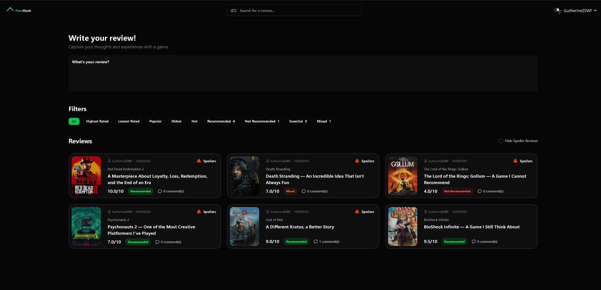

# PixelRank


A game review platform inspired by Letterboxd, where users can rate games,
write reviews, comment, and discover new reviews from the community.

## 🎯 Objetivo

PixelRank aims to offer a platform focused on game reviews, inspired by the Letterboxd experience for movies,
allowing any user to publish, share, and discover game reviews.

## ✨ Funcionalidades

- Review publishing
- Comment system
- Game search using the IGDB API
- User dashboard
- User registration and authentication
- Filters and sorting

## 🚧 Status

Project under development.

## 🛠 Tecnologias

### Backend

- PHP
- Laravel
- Queues & Jobs

### Frontend

- Blade
- Tailwind CSS
- DaisyUI
- JavaScript

### Banco de dados

- MySQL

### APIs

- IGDB API

### Ferramentas

- Git
- Docker (in development)

## 🚀 Instalação

```bash
git clone ...

cd PixelRank

composer install

cp .env.example .env

php artisan key:generate

php artisan migrate

npm install

npm run dev

php artisan serve
```

## 📸 Screenshots

(under construction)

### Home



....

### Login & Register


### Review page
....

### Create review
....

### User profile
....

## 🏗 Architecture

The project follows Laravel's MVC architecture.

Business logic is encapsulated within Services, while Policies handle authorization.
Notifications are responsible for dispatching notifications, and the integration with
the IGDB API is encapsulated in a dedicated service layer to keep controllers thin.

## 📂 Project's Structure

The project's core structure follows Laravel's standard organization,
with clear separation of concerns through Services, Policies, and Notifications.

```text
PixelRank/
│
├── app/
│ ├── Http/
│ │ ├── Controllers/
│ │ ├── Requests/
│ │ └── Middleware/
│ │
│ ├── Models/
│ ├── Services/
│ ├── Policies/
│ └── Notifications/
│
├── database/
│ ├── migrations/
│ └── seeders/
│
├── resources/
│ ├── views/
│ ├── css/
│ └── js/
│
├── routes/
│ └── web.php
│
├── tests/
│
├── .env.example
├── composer.json
└── package.json
```

## 🗺 Roadmap

- [x] Reviews
- [x] Comments
- [ ] Comment interaction
- [x] User creation and authentication
- [x] User dashboard
- [ ] Notification
- [ ] Follower system
- [ ] Private messaging system
- [ ] Recommendation system
- [ ] Internationalization (PT-BR / EN)
- [ ] Docker
- [x] Test
- [ ] Deploy

## 🔐 Segurança

- Authorization using Laravel Policies
- Validation via Form Requests
- Protection against unauthorized actions

## 📄 Licença

This project was developed for study and portfolio purposes.

## 🌐 Demonstração

(soon)